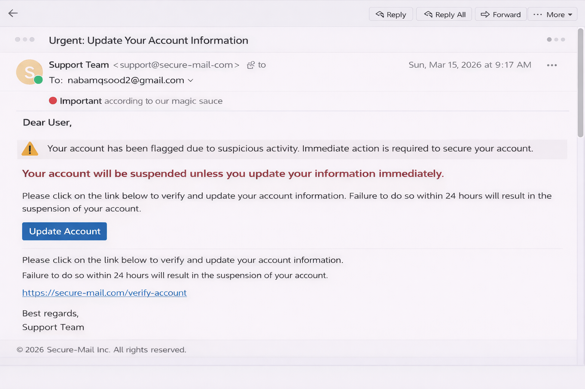
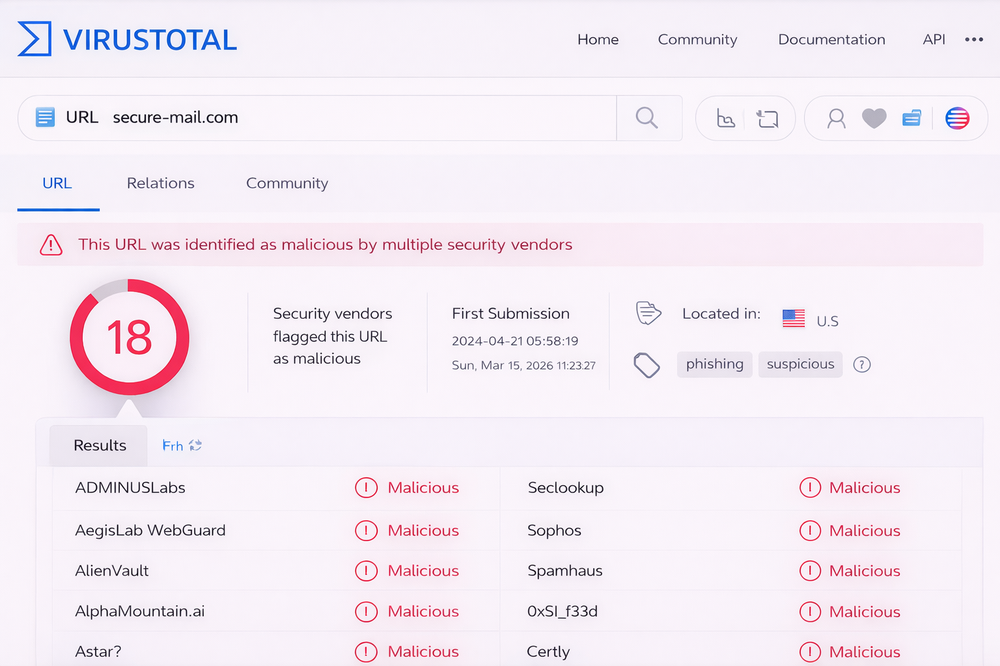

# Phishing Email Analysis – Threat Investigation

## Objective
To analyze a phishing email and identify malicious indicators.

## Tools Used
- MXToolbox
- VirusTotal
- URLScan.io

## Scenario
Analyzed a suspicious email for spoofing and malicious intent.

## Outcome
- Identified phishing indicators
- Extracted IOCs
- Improved threat analysis skills

## Skills Gained
- Email header analysis
- IOC extraction
- Threat assessment

## 📸 Screenshots

### Suspicious Email Sample

### VirusTotal Analysis

