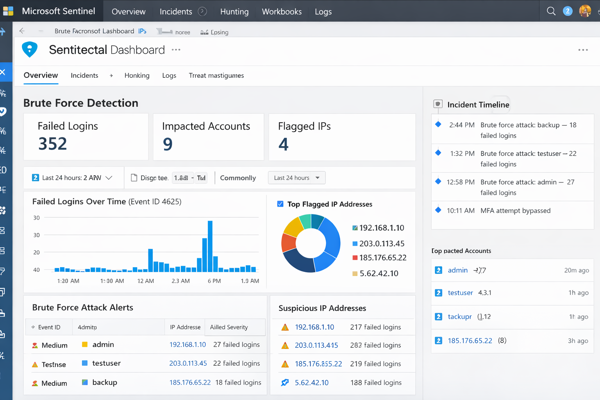
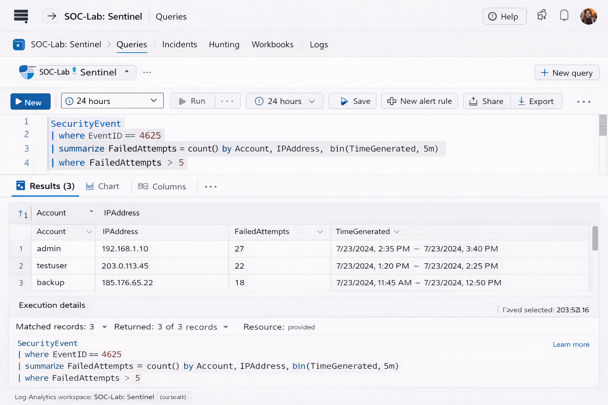

# SOC Lab – Microsoft Sentinel (Brute Force Detection)

## Objective
To simulate and detect brute-force login attempts using Microsoft Sentinel and KQL queries.

## Tools Used
- Microsoft Sentinel
- Azure Log Analytics
- Windows Security Logs

## Scenario
Simulated multiple failed login attempts to replicate a brute-force attack.

## Detection Method
Used KQL queries to identify repeated failed login attempts (Event ID 4625).

## Outcome
- Detected abnormal login behavior
- Identified brute-force attack pattern
- Practiced SOC investigation workflow

## Skills Gained
- SIEM monitoring
- KQL query writing
- Incident investigation

## 📸 Screenshots

### Microsoft Sentinel Dashboard

### KQL Detection Results

## 📌 Key Findings

- Identified suspicious activity through log analysis
- Detected attack patterns using SIEM tools
- Extracted actionable security insights

## 🚨 Detection Summary

This project demonstrates practical detection of security threats using real-world SIEM techniques and analysis methods.
