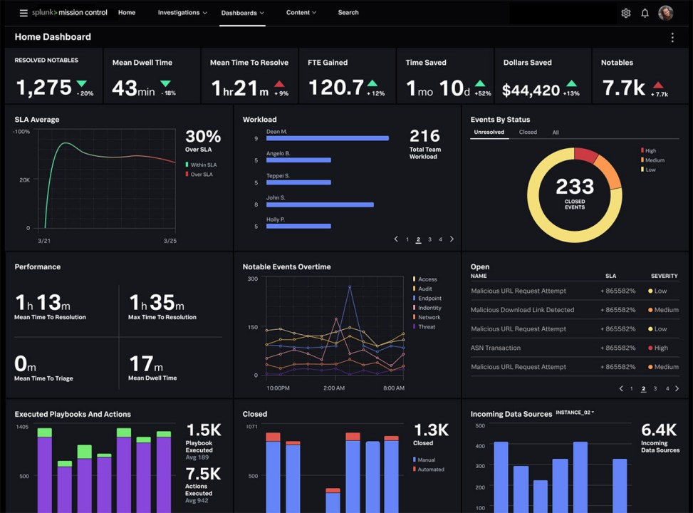
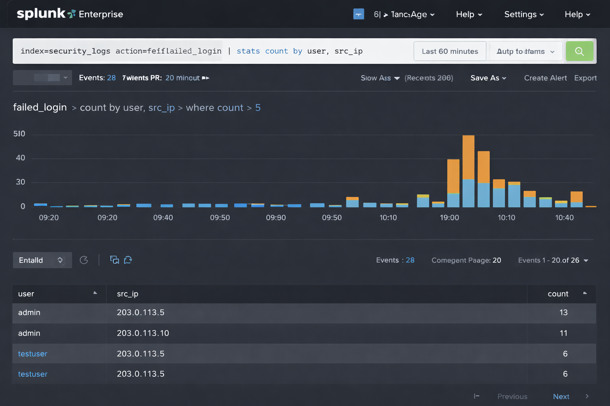

# Splunk SIEM Lab – Brute Force Detection

## Objective
To detect suspicious login activity using Splunk queries.

## Tools Used
- Splunk Free Edition
- Sample security logs

## Scenario
Analyzed login attempts to identify abnormal patterns.

## Outcome
- Detected multiple failed login attempts
- Identified suspicious IP behavior

## Skills Gained
- SPL query writing
- Log analysis
- Threat detection

## 📸 Screenshots

### Splunk Dashboard

### Detection Results

